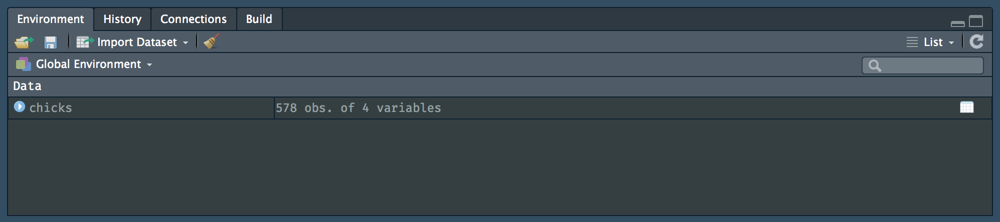
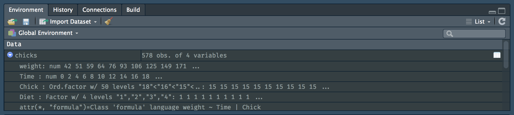

# Types of data

> *“The plural of anecdote is not data.”*
>
> --- Roger Brinner

In this chapter we will, firstly, look at the different kinds of biological and environmental data that are typically encountered by most biologists. The data seen here is not an exclusive list of all the various types of data out there, but it should represent the bulk of our needs.

After we have become familiar with the different kinds of data, we will look at summaries of these data, which is generally required as the starting point for our analysis. After summarising the data in tables and so forth, we may want to produce graphical summaries to see broad patterns and trends; visual data representations, which complement the tabulated data, will be covered in a later chapter (Chapter 3). Both of these approaches form the basis of 'exploratory data analysis.'

## Data classes
In biology we will encounter many kinds of data, and depending on which kind, the type of statistical analysis will decided.

### Numerical data
Numerical data are quantitative in nature. They represent things that can be objectively counted or measured.

#### Nominal (discrete) data
Integer data (discrete numbers or whole numbers), such as counts. For example, family A has 3 children and family B has 1 child. Integer data usually answer the question, "how many?" In R integer data are called `int` or `<int>`.

#### Continuous data
These usually represent measured 'things,' such as something's heat content (temperature, measured in degrees Celsius) or distance (measured in meters or similar), etc. They can be rational numbers including integers and fractions, but typically they have an infinite number of 'steps' that depends on rounding (they can even be rounded to whole integers) or considerations such as precision and accuracy. Often, continuous data have upper and lower bounds that depends on the characteristics of the phenomenon being studied or the measurement being taken. In R, continuous data are denoted `num` or `<dbl>`.

#### Dates
Dates are a special class of continuous data, and there are many different replresenations of the date classes. This is a complex group of data, and we will not cover much of it here.

### Qualitative data
Qualitative data may be well-defined categories or they may be subjective, and generally include descriptive words for classes (e.g. mineral, animal , plant) or rankings (e.g. good, better, best).

#### Categorical data
Also known as qualitative data. Because there are categories, the number of members belonging to each of the categories can be counted. For example, there are three red flowers, 66 purple flowers, and 13 red flowers. The categories cannot be ranked relative to each other; in the example just provided, for instance, no value judgement can be assigned to the different colours. It is not better to be red than it is to be purple. There are just fewer red flowers than purple ones. Contrast this to another kind of categortical data called 'ordinal data' (see next). This class of data in an R dataframe (or in a 'tibble') is indicated by `Factor` or `<fctr>`.

#### Ordinal data
This is a type of categorical data where the classes are ordered (a synonymn is "ranked"), typically from low to high (or vice versa), but where the magnitude between the ordered classes cannot be precisely measured or quantified. In other words, the difference between them is somewhat subjective (i.e. it is qualitative rather than quantitative). These data are on an ordinal scale. The data may be entered as descriptive character strings (i.e. as words), or they may have been translated to an ordered vector of integers; for example, "1" for terrible, "2" for so-so, "3" for average, "4" for good and "5" for brilliant. Irrespective of how the data are present in the dataframe, computationally (for some calculations) they are treated as an ordered sequence of integers, but they are simultaneously treated as categories (say, where the number of responses that report "so-so" can be counted). Ordinal data usually answer questions such as, "how many categories can the phonomenon be divided into, and how does each category rank with respect to the others?" Columns containing this kind of data are named `Ord.factor` or `<ord>`.

### Binary data
Right or wrong? True or false? Accept or reject? Black or white? Positive or negative? Good or bad? You get the idea... In other words, these are observations or responses that can take only one of two mutually exclusive outcomes. In R these are treated as 'Logical' data that take the values of `TRUE` or `FALSE` (note the case), and they are indicated by `logi` or `<lgl>`.

### Complex numbers

### Character values

### Missing values

## Viewing our data
There are many ways of finding broad views of our data in R. The first few functions that we will look at were designed to simply scrutinise the contents of the tibbles, which is the 'tidyverse' name for the general 'container' that holds our data in the software's environment (i.e. in a block of the computer's memory dedicated to the R software). Whatever data are in R's environment will be seen in the 'Environment' tab in the top right of RStudio's four panes.

### From the Environment pane
The first way to see what's in the tibble is not really a function at all, but a convenient (and lazy) way of quickly seeing a few basic things about our data. Let us look at the `ChickWeight` data. Load it like so (you'll remember from the Intro R Workshop):

```{r, message = FALSE}
# loads the tidyverse functions; it contains the 'as_tibble()' function
library(tidyverse)
# the 'ChickWeight' data are built into R;
# here we assign it as a tibble to an object named 'chicks'
chicks <- as_tibble(ChickWeight)
```

In the Environment pane, the object named `chicks` will now appear under the panel named Data. To the left of it is a small white arrow in a blue circular background. By default the arrow points to the right. Clicking on it causes it to point down, which denotes that the data contained within the tibble have become expanded. The names of the columns (more correctly called 'variables') can now be seen. There you can see the variables `weight`, `Time`, `Chick` and `Diet`. The class of data they represent can be seen too: there's continuous data of class `num`, a variable of `Ord.factor`, and a categorical variable of class `Factor`. Beneath these there's a lot of attributes that denote some meta-data, which you may safely ignore for now.

```{r chicks_1, echo = FALSE, fig.cap = "What is in the Chicks data?"}

```

```{r chicks_2, echo = FALSE, fig.cap = "This is what is in the Chicks data"}

```

### `head()` and `tail()`
The `head()` and `tail()` functions simply display top and bottom portions of the tibble, and you may add the `n` argument and an integer to request that only a certain number of rows is returned; by default the top of bottom six rows are displayed.

There are various bits of additional information printed out. The display will change somewhat if there are many more variables than that which can comfortably fit within the width of the window (typically the Console). The same kinds of information as was returned with the Environment pane expansion arrow are displayed, but the data class is now accompanied by an angle bracket (i.e. `<...>`) notation. For example, `num` in the Environment pane and `<dbl>` as per the `head()` or `tail()` methods are exactly the same: both denote continuous (or 'double precision') data.

```{r}
head(chicks)
tail(chicks, n = 2)
```

As an alternative to `head()`, you may also simply type the name of the object (here `chicks`) in the Console (or write it in the Source Editor if it is necessary to retain the function for future use) and the top portion of the tibble will be displayed, again trimmed to account for the width of the display.

### `colnames()`
This function simply returns a listing of the variable (column) names.

```{r}
colnames(chicks)
```

There is an equivalent function called `rownames()` that may be used to show the names of rows in your tibble, if these are present. Row names are generally discouraged, and we will refrain from using them here.

### `summary()`
The next way to see the contents of the tibble is to apply the `summary()` function. Here we see something else. Some descriptive statistics that describe properties of the full set of data are now visible. These summary statistics condense each of the variables into numbers that describe some properties of set of data within each column. You will already know the concepts of the 'minimum,' 'median,' 'mean,' and 'maximum.' These are displayed here.

```{r}
summary(chicks)
```

This will serve well as an introduction to the next chapter, which is about the descriptive stastics. What are they, and how do we calculate them?
