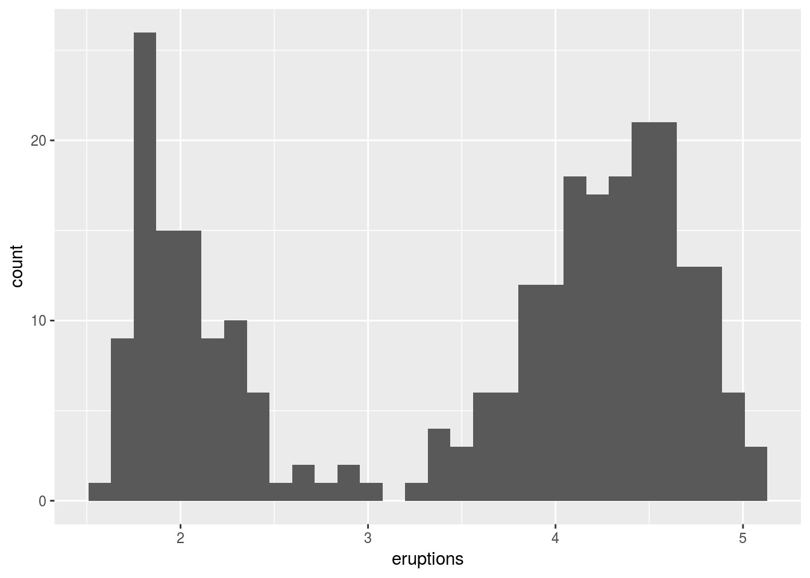

# Graphical data displays


```r
library(tidyverse)
library(ggpubr)
```

## Frequency distributions

### Qualitative data

#### Frequency distribution
This kind of graph applies to categorical data. Although it can also be presented numerically in tabular form, one may also create a bar or pie graph of the number of occurences in a collection of non-overlapping classes or categories. Both approaches will be demonstrated here.

<!-- show example of numerical summary -->
<!-- show example of frequency distribution bar graph -->
<!-- show example of pie graph -->

#### Relative frequency distributions
This is similar to the frequency distribution of qualitative data, except that now we show the frequency proportion in a collection of non-overlapping categories. An example: 

We have a sample size of 12 ($n=12$). In this sample, two are coloured blue, six red, and five purple. The relative proportions are $2/12=0.1666667$ blue, $6/12=0.5$ red, and $5/12=0.4166667$ purple. The important thing to note here is that the relative proportions sum to 1, i.e. $0.1666667+0.5+0.4166667=1$. These data may be presented as a table or as a graph.

<!-- show example of numerical summary -->
<!-- show example of frequency distribution bar graph -->
<!-- show example of pie graph -->

### Continuous data

#### Frequency distribution (histograms)


```r
ggplot(data = faithful, aes(x = eruptions)) +
  geom_histogram()
```




<!-- show example of numerical summary -->
<!-- show example of a histogram -->

#### Relative frequency distributions


```r
faithful %>% 
  mutate(eruptions = eruptions / length(eruptions)) %>%
  ggplot(aes(x = eruptions)) +
  geom_histogram(aes(y = ..ndensity..))
```


```r
# ggplot(data = faithful, aes(x = eruptions)) +
#   geom_density(fill = "salmon", aes(y = ..density..)) +
#   scale_x_continuous(expand = c(0, 0)) +
#   scale_y_continuous(expand = c(0, 0))
```
<!-- show example of numerical summary -->
<!-- show example of a histogram (desnity/probability) -->

#### Cumulative frequency distributions

<!-- show example of numerical summary -->
<!-- show example of a cumulative frequency graph -->

#### Cumulative relative frequency distributions

<!-- show example of numerical summary -->
<!-- show example of a cumulative relative frequency graph -->

#### Scatter plots
Relationship between two (matched) continuous variables.

<!-- show example of a scatter plot -->
<!-- show example of correlation -->

#### Box plots
Box plots are sometimes called box-and-whisker plots. These graphs are a a graphical representation of the data based on its quartiles as well as its smallest and largest values. The keen eye can glance the 'shape' of the data distribution.

<!-- show example of a box plot -->

## Bar graphs

## Pie graphs (!!!)

## Category statistics
