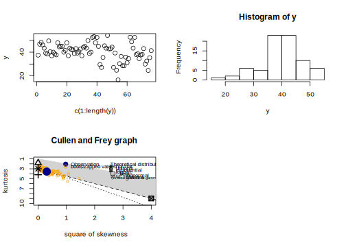
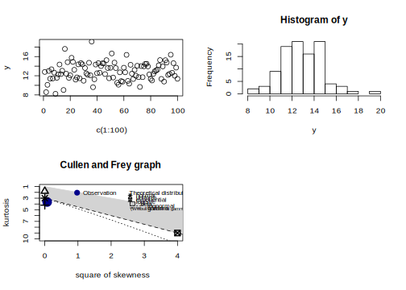
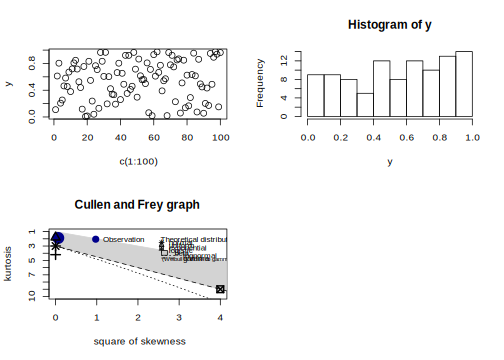
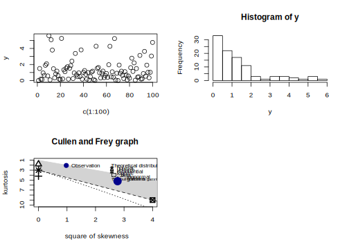
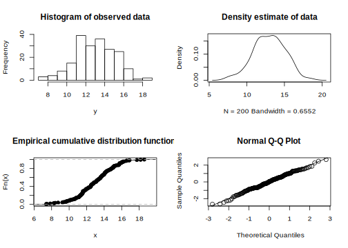

# Distributions


Therefore, we must next learn about the different types of data distributions we are likely to encounter in the wild.

## Discrete distributions
A discrete random variable has a finite or countable number of possible values. As the name suggests, it models integer data. Below we provide options to generate and visualise data belonging to several classes of discrete distributions. Later (Chapter 11) we will learn how to transform these data prior to performing the appropriate statistical analysis.

### Bernoulli distribution
A Bernoulli random variable, $x$, takes the value 1 with probability $p$ and the value 0 with probability $q=1−p$. It is used to represent data resulting from a *single* experiment with binary (yes or no; black or white; positive or negative; success or failure; dead or alive;) outcomes, such as a coin toss---there are only two options, heads or tails. Nothing else. Here, $p$ represents the probability of the one outcome and $q$ the probability of the other outcome. The distribution of the possible outcomes, $x$, is given by:

$$
f(x;p)=
  \begin{cases}
    p, &\text{if}~x=1\\
    1-p, &\text{if}~x=0
  \end{cases}
$$


### Binomial distribution
A binomial random variable, $x$, is the sum of $n$ independent Bernoulli random variables with parameter $p$. This data distribution results from repeating identical experiments that produce a binary outcome with probability $p$ a specified number of times, and choosing $n$ samples at random. As such, it represents a collection of Bernoulli trials.

$$f(x;n,p)= {n\choose x}p^{x}(1-p)^{n-x}$$


### Negative binomial distribution
A negative binomial random variable, $x$, counts the number of successes in a sequence of independent Bernoulli trials with probability $p$ before $r$ failures occur. This distribution could for example be used to predict the number of heads that result from a series of coin tosses before three tails are observed:

$$f(x;n,r,p)= {x+r-1\choose x}p^{x}(1-p)^{r}$$

where $x$ is the number of successes, $r$ is the number of failures, and $p$ is the probability of success


### Geometric distribution
A geometric random variable, $x$, represents the number of trials that are required to observe a single success. Each trial is independent and has success probability $p$. As an example, the geometric distribution is useful to model the number of times a die must be tossed in order for a six to be observed. It is given by:

$$f(x;p)=(1-p)^{x}p$$


### Poisson distribution
A Poisson random variable, $x$, tallies the number of events occurring in a fixed interval of time or space, given that these events occur with an average rate $\lambda$. Poisson distributions can be used to model events such as meteor showers and or number of people entering a shopping mall. This equation describes the Poison distribution:

$$f(x;\lambda)=\frac{\lambda^{x}e^{-\lambda}}{x!}$$


## Continuous distributions

### Normal distribution

Another name for this kind of distribution is a Gaussian distribution. A random sample with a Gaussian distribution is normally distributed. These values are identically distributed and independent---we say they are independent and identically distributed random variables (i.i.d.), and they have an expected mean given by $\mu$ (or $\hat{x}$ in Chapter 3.2.1) and a finite variance given by $\sigma^{2}$ (or $S^{2}$ in Chapter 3.3.1); if the number of samples drawn from a population is sufficiently large, the estimated mean and SD will be indistinguishable from the population (as per the central limit theorem).


\begin{figure}[h!]
\begin{center}
\includegraphics[width=0.7\linewidth]{figures/Boxplot_vs_PDF.png}
\end{center}
\caption{Boxplot and probability density function of a normal distribution. Credit: Wikipedia.}
\end{figure}

### Uniform distribution

The continuous uniform distribution is sometime called a rectangular distribution. Simply, it states that all measurements of the same magnitude included with this distribution are equally probable. This is basically random numbers.


### Student T distribution

This is a continuous probability distribution that arises when estimating the mean of a normally distributed population in situations where the sample size is small and population standard deviation is unknown. It is used in the statistical significance testing between the means of different sets of samples, and not much so in the modelling of natural phenomena.


### Chi-squared distribution

Mostly used in hypothesis testing, but not to encapsulate the distribution of data drawn to represent natural phenomena.


### Exponential distribution

This is a probability distribution that describes the time between events in a Poisson point process, i.e., a process in which events occur continuously and independently at a constant average rate.


### F distribution


### Gamma distribution


### Beta distribution


### Paranormal distributions

\begin{figure}[h!]
\begin{center}
\includegraphics[width=0.7\linewidth]{figures/paranormal_distributions.jpeg}
\end{center}
\end{figure}

## Finding one's data distribution
data belonging to a sample will never exactly follow a specific distribution, even when the test for normality says it does---there will always be a small probability that they are non-normal and is in fact better described by some other distribution. In other words, data are only *compatible* with a certain distribution, and one can never answer the question "Does my data follow the distribution xy exactly?" as simply as providing a yes/no answer. So what now? How does one find one's data distribution? We can use the *Cullen and Frey graph* function that lives in the **fitdistrplus** package. This graph tells us whether the skewness and kurtosis of our data are consistent with that of a particular distribution. We will demonstrate by generating various data distributions and testing them using the Cullen and Frey graph.


```r
library(fitdistrplus)
```

```
## Loading required package: MASS
```

```
## Loading required package: survival
```

```
## Loading required package: npsurv
```

```
## Loading required package: lsei
```

```r
library(logspline)

# Generate log-normal data
y <- c(37.50,46.79,48.30,46.04,43.40,39.25,38.49,49.51,40.38,36.98,40.00,
38.49,37.74,47.92,44.53,44.91,44.91,40.00,41.51,47.92,36.98,43.40,
42.26,41.89,38.87,43.02,39.25,40.38,42.64,36.98,44.15,44.91,43.40,
49.81,38.87,40.00,52.45,53.13,47.92,52.45,44.91,29.54,27.13,35.60,
45.34,43.37,54.15,42.77,42.88,44.26,27.14,39.31,24.80,16.62,30.30,
36.39,28.60,28.53,35.84,31.10,34.55,52.65,48.81,43.42,52.49,38.00,
38.65,34.54,37.70,38.11,43.05,29.95,32.48,24.63,35.33,41.34)

par(mfrow = c(2, 2))
plot(x = c(1:length(y)), y = y)
hist(y)
descdist(y, discrete = FALSE, boot = 100)
```

```
## summary statistics
## ------
## min:  16.62   max:  54.15 
## median:  40.38 
## mean:  40.28434 
## estimated sd:  7.420034 
## estimated skewness:  -0.551717 
## estimated kurtosis:  3.565162
```




```r
# normally distributed data
y <- rnorm(100, 13, 2)
par(mfrow = c(2, 2))
plot(x = c(1:100), y = y)
hist(y)
descdist(y, discrete = FALSE)
```

```
## summary statistics
## ------
## min:  8.234155   max:  19.13087 
## median:  12.68158 
## mean:  12.87995 
## estimated sd:  1.889267 
## estimated skewness:  0.2677673 
## estimated kurtosis:  3.656304
```




```r
# uniformly distributed data
y <- runif(100)
par(mfrow = c(2, 2))
plot(x = c(1:100), y = y)
hist(y)
descdist(y, discrete = FALSE)
```

```
## summary statistics
## ------
## min:  0.001748776   max:  0.998208 
## median:  0.565699 
## mean:  0.5424293 
## estimated sd:  0.2859536 
## estimated skewness:  -0.222194 
## estimated kurtosis:  1.903102
```




```r
# uniformly distributed data
y <- rexp(100, 0.7)
par(mfrow = c(2, 2))
plot(x = c(1:100), y = y)
hist(y)
descdist(y, discrete = FALSE)
```

```
## summary statistics
## ------
## min:  0.02998446   max:  9.579291 
## median:  1.071474 
## mean:  1.677007 
## estimated sd:  1.660634 
## estimated skewness:  1.911995 
## estimated kurtosis:  8.362931
```



There is also a whole bunch of other approaches to use to try and identify the data distribution. Let us start with the gold standard first: normal data. We will demonstrate some visualisation approaches. The one that you already know is a basic histogram; it tells us something about the distribution's skewness, the tails, the mode(s) of the data, outliers, etc. Histograms can be compared to shapes associated with idealistic (simulated) distributions, as we will do here.


```r
y <-rnorm(n = 200, m = 13, sd = 2)
par(mfrow = c(2, 2))
# using some basic base graphics as ggplot2 is overkill;
# we can get a histogram using hist() statement
hist(y, main = "Histogram of observed data")
plot(density(y), main = "Density estimate of data")
plot(ecdf(y), main = "Empirical cumulative distribution function")
# standardise the data
z.norm <- (y - mean(y)) / sd(y) 
# make a qqplot
qqnorm(z.norm)
# add a 45-degree reference line
abline(0, 1)
```



Above we have also added a diagonal line to the qqplot. If the sampled data come from the population with the chosen distribution, the points should fall approximately along this reference line. The greater the departure from this reference line, the greater the evidence for the conclusion that the data set have come from a population with a different distribution.


```r
# curve(dnorm(100, m = 10, sd = 2), from = 0, to = 20, main = "Normal distribution")
# curve(dgamma(100, scale = 1.5, shape = 2), from = 0, to = 15, main = "Gamma distribution")
# curve(dweibull(100, scale = 2.5, shape = 1.5), from = 0, to = 15, main = "Weibull distribution")
```


## Exercises

### Exercise 1

Choose two different datasets and plot them as histograms with density curves overlayed. Label them with the distribution they appear to be and stitch them together with `ggarrange()`.
