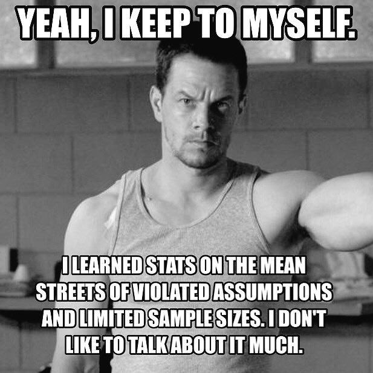

--- 
title: "Basic Statistics"
subtitle: A primer in basic statistics for BCB (Hons) 2018
author: "AJ Smit and Robert Schlegel"
description: "A Book about Basic Statistics."
thanks: Replication files are available on the author's GitHub account
date: "`r Sys.Date()`"
bibliography:
- LaTeX/bibliography.bib
- LaTeX/packages.bib
site: bookdown::bookdown_site
citecolor: purple
urlcolor: blue
cover-image: figures/NSFW.jpg
biblio-style: apalike
papersize: A4
geometry: margin=4cm
fontsize: 10pt
github-repo: ajsmit/Basic_stats
language: Australian
link-citations: yes
linkcolor: cyan
tables: yes
lof: no
lot: no
always_allow_html: yes
---

# Preface {-}

```{r prelim-opts, echo=FALSE}
knitr::opts_chunk$set(
  comment = "R>", 
  warning = FALSE, 
  message = FALSE,
  out.width = '70%'
)
```

```{r rmarkdown, echo = FALSE}

```

This is a workshop about the practice of the basic statistics used by biologists, and not about the theory and mathematical underpinnings of the methods used. Each of the Chapters will cover a basic kind of statistical approach, and the main classes of data it applies to. Since much insight and understanding can be gained from visualising our data, we will also explore the main types of graphical summaries that best accompany the statistical methodologies. It is our intention to demonstrate how we go about analysing our data. 

# Prerequisites {-}
A prerequisite for this course is a basic proficiency in using R [@R2017]. The necessary experience will have been gained from completing the [Intro R Workshop: Data Manipulation, Analysis, and Graphing](https://robwschlegel.github.io/Intro_R_Workshop/) Workshop that was part of your BCB Core Honours module (i.e. Biostatistics). You will also need a laptop with R and RStudio installed as per the instructions provided in that workshop. If you do not have a personal laptop, most computers in the 5th floor lab will be correctly set up for this purpose.


